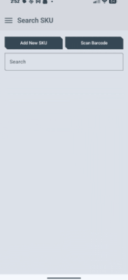
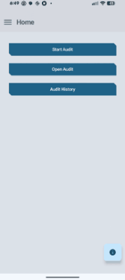
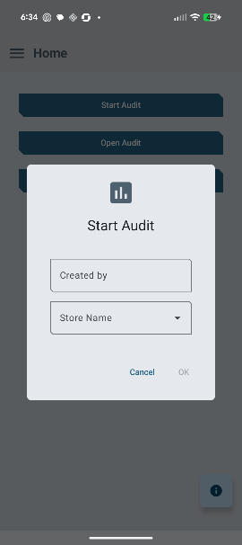
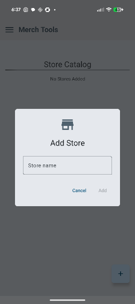
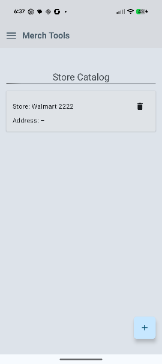
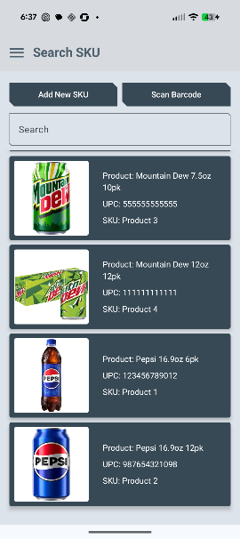
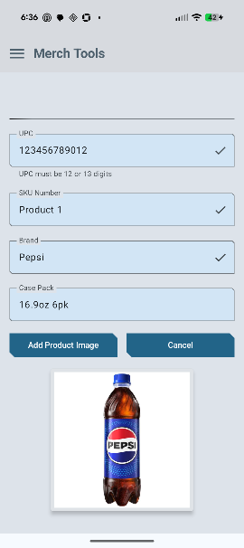
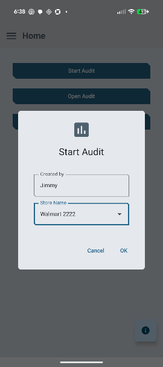
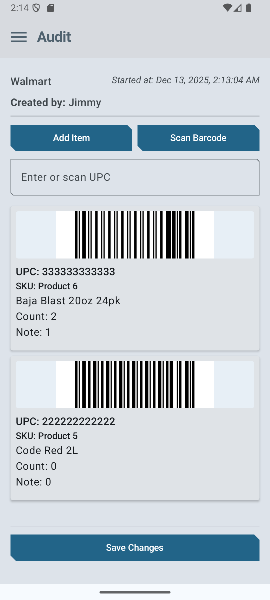
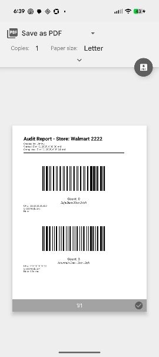

# ⚒️ Merch Tools
## A inventory & shelf audit assistant for field merchandisers and vendors - Android app

---

---


## 📹 App demo

<details open>
    <summary><h3>Merch Tools</h3></summary>

|                                            App demo                                             |                                     Scan Barcode Demo                                      |
|:-----------------------------------------------------------------------------------------------:|:------------------------------------------------------------------------------------------:|
|  |  |

</details>

---

*  More [screenshots](#-screenshots) below
* See [tests](#-tests)
*  See [contributing](#contributing)
*  See [features](#-features) and [finished implementations](#-finished-implementations)
*  Contact me [here](#-contact)

## 💾 Technologies Used

- **Key Technologies**:
  - **UI**: Jetpack Compose
  - **Architecture**: Clean Architecture (data/domain/ui), MVVM
  - **State Management**: ViewModel
  - **Dependency Injection**: Hilt
  - **Data Persistence**: Room/SQLite
  - **Navigation**: [Compose Destinations](https://github.com/raamcosta/compose-destinations)
  - **Barcode Scanning**: [ML Kit Barcode Scanning](https://developers.google.com/ml-kit/vision/barcode-scanning/android)
  - **CameraX Image Analysis**: [CameraX](https://developer.android.com/media/camera/camerax)

---
## 🚀 Getting Started

To get a local copy up and running follow these simple example steps.

### Prerequisites

*   **Android Studio**
*   **Min SDK Version**: 26

### Installation

1.  **Clone the repo**
    ```bash
    git clone https://github.com/f-mousecop/MerchTools.git
    ```
2. **Open the project in Android Studio**:
    - Navigate to the project folder and open the `build.gradle` file to sync the project with the necessary dependencies.
3. **Run the app**:
    - Select your preferred emulator or physical device and run the app.

---

## 📄 Tests
* **UI Tests**: [UI Test Summary](tests/ui_home_test.html)
* **Unit Tests**: [Unit Test Summary](tests/unit_tests.html)

---

## 🗃️ Project Structure

This project is built upon the principles of **Clean Architecture** and **MVVM**.
Throughout planning and implementation, I learned more about separation of concerns using these principles

###  Modular Structure

* **/app**: Main application module
  * **/core**: Shared utilities
  * **/data**: Data layer 
    * **/local**: Local data sources
      * **/dao**
      * **/entity**
      * **/relations**
      * **/repository**
    * **/remote**: Remote data sources
    * **/mappers**: Data mappers
    * **/util**: Utility classes
  * **/di**: Dependency injection modules (Hilt)
  * **/domain**: Domain layer
    * **/model**
    * **/repository**: Repository interfaces
    * **/use_case**:
    * **/util**
    * **/validation**: Logic validation files
  * **/ui**: UI layer-related code for each screen/ViewModel/components
    * **/audit**
    * **/components**
    * **/feature_scanner**
    * **/history**
    * **/report**
    * **/searchsku**
    * **/store**
    * **/theme**

---

## 💡 Features

* Search product/SKU
* Scan UPC/barcode 
  * Auto fills audit item fields
  * Enter shelf/inventory count
  * Add photo
  * Add note 
* Generate a PDF report
* Share/send email to store leadership to rectify inventory issues

---

## 🪛 Contributing Guidelines

###  Contributing

Feel free to contribute to the repository by suggesting improvements, fixing bugs, improving documentation, adding features, etc. To contribute:
1. Fork the repository
2. Create a new branch
3. Make any changes
4. Submit a pull request

---

### License and Authors

* This project is licensed under the MIT License - see the [MIT License](LICENSE.md) for details
* **Credit to the following developers**:
    * [DUMA042](https://github.com/DUMA042/BarsandQ) (CameraX/ML Kit integration)
    * [realityexpander](https://github.com/realityexpander/ComposeSwipeToDelete) (Swipe to delete compose container)

---

# 📩 Contact

Reach out to me via [email](mailto:charles.fmousecop@protonmail.com) for any questions 😁

---
## ✅ Finished Implementations

- [x] Data repositories, DAOs, entities, relations, domain mappers
- [x] Home Screen (buttons to nav -> Start Audit, -> Open Audit, -> Audit History)
- [x] Audit Screen (implemented Add Item for adding a blank Audit Item to the list; added a add by 
UPC text field - fills in SKU details if match is found)
- [x] SKU list with search functionality; displays SKU details (UPC, name, case pack, brand)
- [x] Started working on EditAuditItemScreen (user clicks AuditItem card in Audit list, nav -> EditAuditItem)
  - [x] Implemented the screen UI
  - [x] All fields required (pre-filled UPC, SKU details, editable note and count stepper)
  - [x] Need to implement proper add photo
- [x] Configured type converter to display correct started at time and store object in the database
- [x] Fixed theming issue on physical device (dynamicColor = false)
- [x] Scan UPC/barcode 
  - [x] Auto fills audit item fields 
  - [x] Enter shelf/inventory count 
  - [x] Add photo 
  - [x] Add note
- [x] Generate a PDF report
- [x] Share/send email to store leadership to rectify inventory issues

---

## 📷 Screenshots

 
 

---

 
 