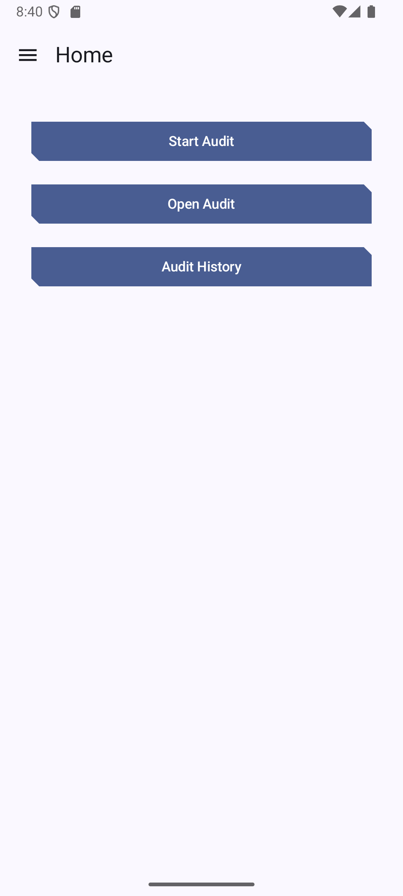
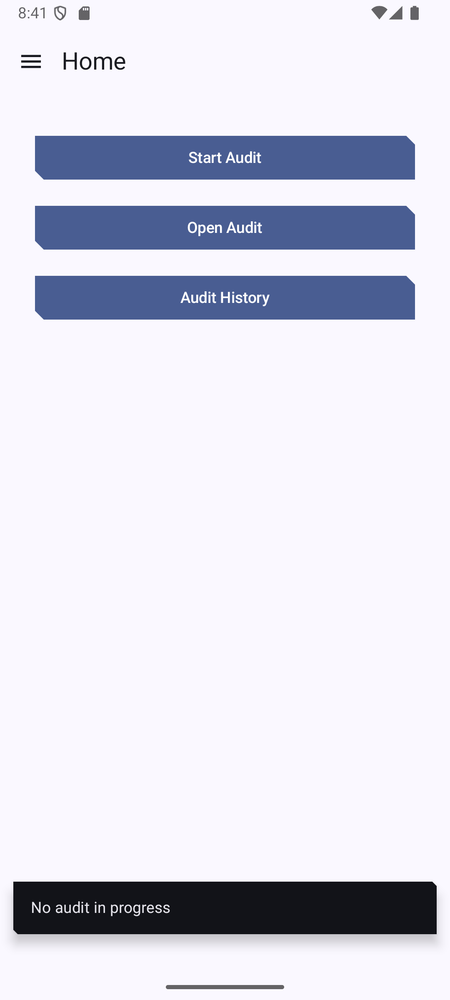
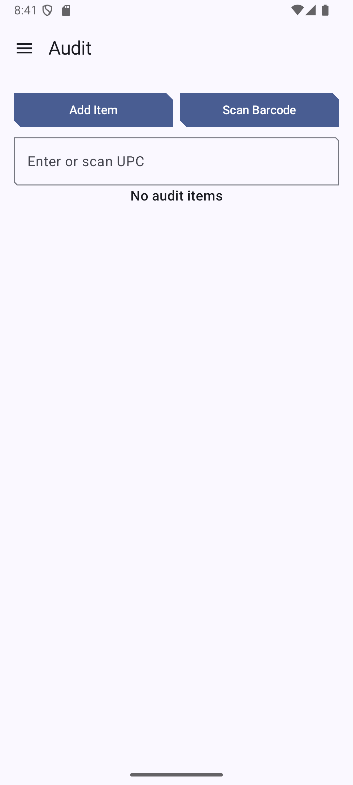
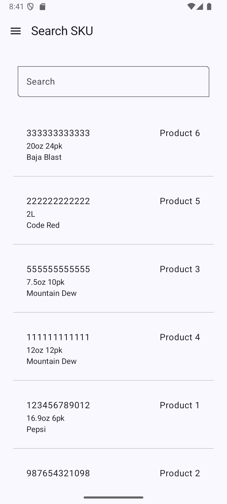
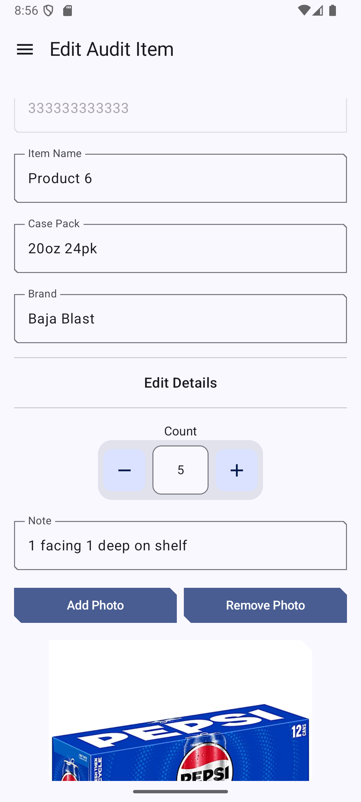
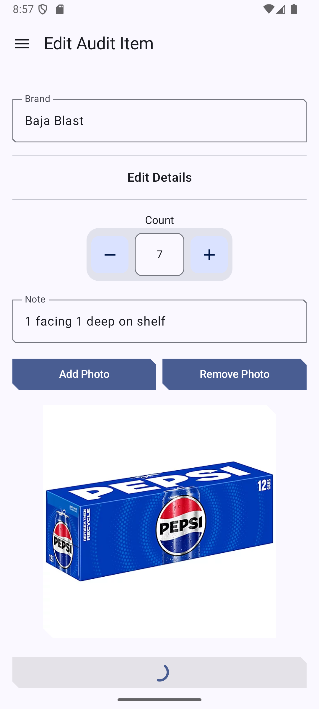
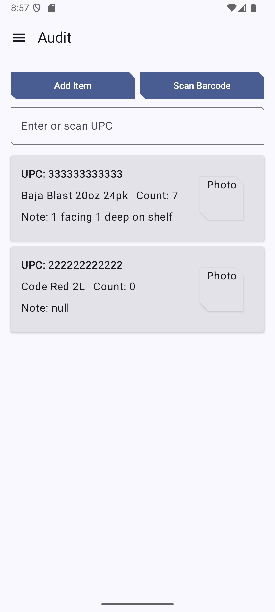

# Merch Tools

---
## Merch Tools is an inventory & shelf audit assistant for field merchandisers and vendors.

---
## Features (TODO)

- Search product/SKU
- Scan UPC/barcode 
  - Auto fills audit item fields
  - Enter shelf/inventory count
  - Add photo
  - Add note
- Generate a PDF report
- Share/send email to store leadership to rectify inventory issues

---

### Finished Implementations

---

- [x] Data repositories, DAOs, entities, relations, domain mappers
- [x] Home Screen (buttons to nav -> Start Audit, -> Open Audit, -> Audit History)
- [x] Audit Screen (implemented Add Item for adding a blank Audit Item to the list; added a add by 
UPC text field - fills in SKU details if match is found)
- [x] SKU list with search functionality; displays SKU details (UPC, name, case pack, brand)
- [ ] Started working on EditAuditItemScreen (user clicks AuditItem card in Audit list, nav -> EditAuditItem)
  - [x] Implemented the screen UI
  - [x] All fields required (pre-filled UPC, SKU details, editable note and count stepper)
  - [ ] Need to implement proper add photo
- [x] Configured type converter to display correct started at time and store object in the database
- [x] Fixed theming issue on physical device (dynamicColor = false)

---

### Next

---

- [ ] Implement barcodescanner
- [ ] Implement proper SKU catalog and ability to add SKU via manual entry or scan

# IMPORTANT

- Need to fix add sku use case, currently when adding SKU the skuID is not passed to edit sku screen
- When clicking SKU in list, the skuID is passed, but when clicked saved the changes do not reflect
  - Made changes to SkuRepository - changed getSkuById from Flow<Sku?> to Sku?

---

## Screenshots

---

 
 

---

 
 

## Screen captures

---

